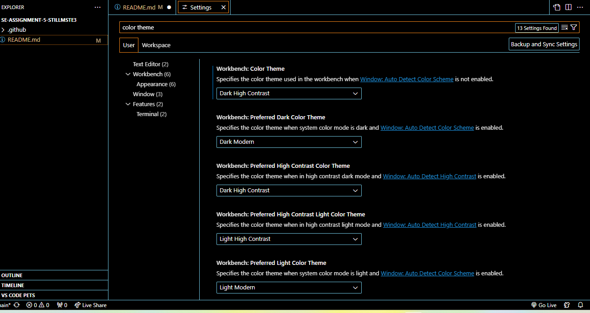
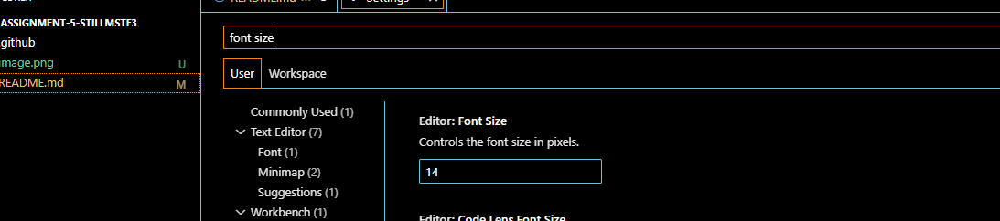

# SE-Assignment-5
Installation and Navigation of Visual Studio Code (VS Code)
 Instructions:
Answer the following questions based on your understanding of the installation and navigation of Visual Studio Code (VS Code). Provide detailed explanations and examples where appropriate.

 Questions:

1. Installation of VS Code:
   - Describe the steps to download and install Visual Studio Code on Windows 11 operating system. Include any prerequisites that might be needed.

 To install VS Code on Windows 11, ensure that your system is running on Windows 11. If not downaload Windows and go to your browser and search for visual studio code.
 Click the download button for windows and once it is complete open the file to install it.
 You will be asked if you want to allow the app to make changes to your device. Click yes and read and accept the license agreement then select where you want to save the installation and click install to finish the installation.

2. First-time Setup:
   - After installing VS Code, what initial configurations and settings should be adjusted for an optimal coding environment? Mention any important settings or extensions.

   - Customize your vs code by selecting a theme either from the built in themes or you can download one from the extensions marketplace
   - Ensure git is properly configured by setting up your username and email address in git
   - Install extensions such as live server and prettier from the extensions marketplace and ensure you have the latest vs code.

3. User Interface Overview:
   - Explain the main components of the VS Code user interface. Identify and describe the purpose of the Activity Bar, Side Bar, Editor Group, and Status Bar.

   The activity bar provides quick access to various views and features through icons. Default icons include:
   - Explorer: shows your files and folders, also opens them
   - Search
   - Extensions: takes you to the market place where you can download extensions
   - Run and Debug: runs and debugs code

   The side bar displays different content. It provides a detailed view and interaction space for different tools and panels.

   The editor group is where you write and edit code. It has multiple tabs and panels which allow one to work on several files at the same time. You can split the editor into multiple panes to view and edit files side by side, and different elements of code are color coded based on the programming language.

   The status bar provides essential contextual information and shortcuts to your workspace and files.
   It shows the current bit branch you arre working on and displays errors.

4. Command Palette:
   - What is the Command Palette in VS Code, and how can it be accessed? Provide examples of common tasks that can be performed using the Command Palette.

   The Command Palette in Visual Studio Code is a powerful feature that provides quick access to a wide range of commands and settings without having to navigate through menus. It allows you to perform tasks, configure settings, and execute commands efficiently. It can be accessed by pressing Ctrl + Shift + P on windows or you can access it through view in the menu tab.
   You can run editor commands, open files, search for symbols and see a quick outline of a file in the command palette.

5. Extensions in VS Code:
   - Discuss the role of extensions in VS Code. How can users find, install, and manage extensions? Provide examples of essential extensions for web development.

   Extensions in vs code enhance functionality and productivity of the editor. They allow users to customize their development area and add new features according to their needs.
   You can find the extensions at the marketplace by either clicking on the extensions icon or pressing Crtl + Shift + X. Then you can search for the extension you want by typing it's name or by using a keyword. After you find the extension you are looking for you simply just click the install buttun to install it and it will be immediately available for use.
   You can manage extensions by disabling, updating or even uninstalling them. Extensions can be disabled and uninstalled by right clicking on them then selecting the uninstall/disable option.
   Some essential extensions for web development include:
   - Live server: live server allows you to quickly view the changes to your file in the browser without having to reload the browser everytime you make changes.
   - Prettier: automatically formats code to ensure consistent style across your project.
   - ESlint: analyses your JavaScript code and fixes errors in them.

6. Integrated Terminal:
   - Describe how to open and use the integrated terminal in VS Code. What are the advantages of using the integrated terminal compared to an external terminal?

   You can open the integrated terminal by pressing Crtl + `` or you can open it by clicking termianl in the view tab. The integated terminal in vs code is advantageous because it automatically opens the root directory of your workspace and can easily run scripts/commands on the file you are you are working on by dragging it to the terminal. The integrated termianl in vs code also allows you to work on several terminal sessions in the same window, each in it's tab. It also allows you to write and debug code without having to switch windows.

7. File and Folder Management:
   - Explain how to create, open, and manage files and folders in VS Code. How can users navigate between different files and directories efficiently?

   You can create and open files and folders in the file explorer.
   In the file explorer pane, click on the directory where you want to create your file, and select new file then name the file and include it's file extension in the name the press enter to create the file.
   To create a folder you open the file explorer and click the diectory where you want your folder then select new folder and press enter to after naming the folder to create it.
   To open file and folders, click on the file tab and navigate to the file/folder you want to open and click on it to open it.
   To delete andd rename files and folders you go the file tab, right click on the file/folder then select rename/delete. You can also navigate through files and folders in the explorer and you can switch between open files by clicking on their tabs at the top of the editor.

8. Settings and Preferences:
   - Where can users find and customize settings in VS Code? Provide examples of how to change the theme, font size, and keybindings.

   In vs code users can find and customize settings through the command pallete and through the menu. To access them through the menu you have to click file > preferences > settings.
   To change the theme, open settings and type color theme in the search bar then choose a theme.
    or you can download a theme at the extensions marketplace.
   To change the font size, follow the steps you did to change the theme and type font size in the search bar then enter the font size you want.
    To change keybindings go to file > preferences > keyboard shortcuts and change your keybindings to your desire.
   

9. Debugging in VS Code:
   - Outline the steps to set up and start debugging a simple program in VS Code. What are some key debugging features available in VS Code?

   VS Code has built-in debugging support for the node.js runtime and can debug languages that get transpiled to JavaScript. To debug other languages and runtimes you will habve to look for debuggers extensions in the marrketplace or select install additional debuggers in the top level run menu. To start debbuging create a simple program and select run and debug in the activity bar.
   Run and debug view displays all information related to running and debugging. Once it runs it will show you where there are bugs and even show you the exact line in your code where the error is.

10. Using Source Control:
    - How can users integrate Git with VS Code for version control? Describe the process of initializing a repository, making commits, and pushing changes to GitHub.

    To use git and github in vs code you have to make sure you have git installed, then you can get started in a git repository from a local to remote cloud-powered environment like github codespaces.
    To clone a git repository locally you have to run the git clone command in the command palette, or select clone repository in the source control view. When you clone from github vs code prompts you to authenticate with github.

   - To initialize a new local git repository, pick an existing or new folder and open it in vs code
   - Select initialize source control in the spurce control view
   - To make commits and pushing changes to github use the following commands:
   - git add .
   - git commit -m "your message" (to commit) and
   - git push to push your changes

   Reference:
   geeksforgeeks
   https://www.geeksforgeeks.org/gitpush-with-visual-studio-vs-code/
   dev community (2024) 3 june
   https://dev.to/umeshtharukaofficial/version-control-in-vscode-integrating-git-and-github-55gf
   vscode
   https://code.visualstudio.com/docs/terminal/basics

 Submission Guidelines:
- Your answers should be well-structured, concise, and to the point.
- Provide screenshots or step-by-step instructions where applicable.
- Cite any references or sources you use in your answers.
- Submit your completed assignment by 1st July 

